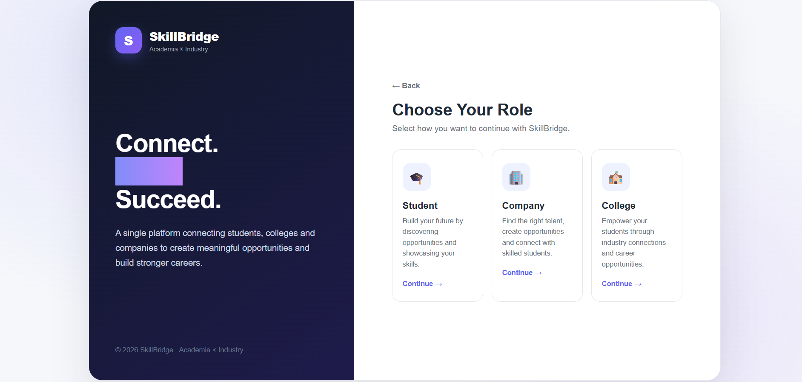
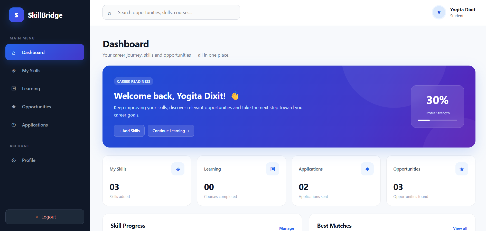
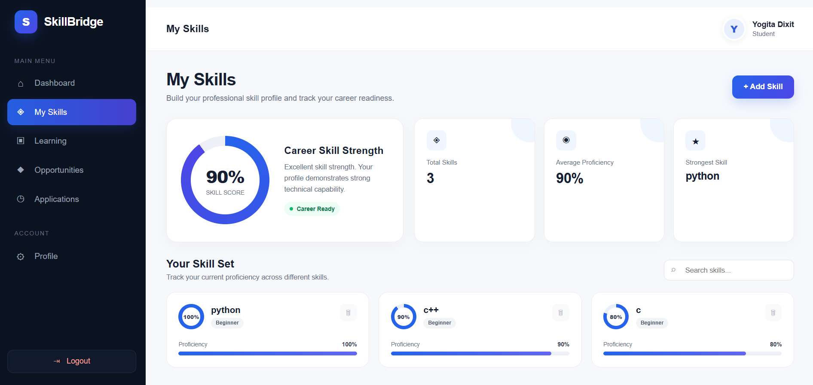
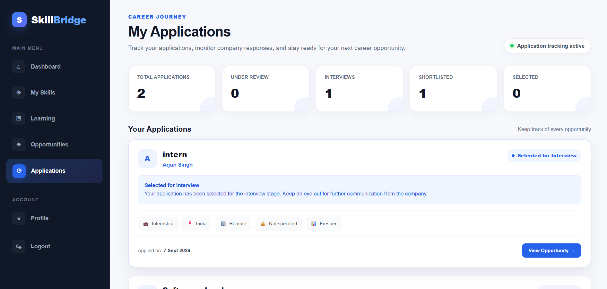
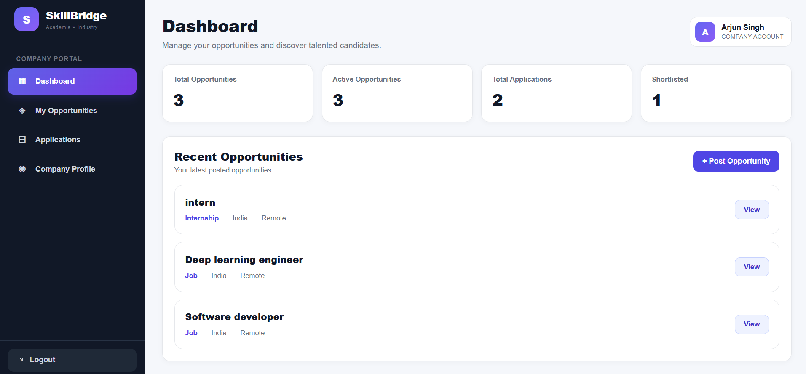
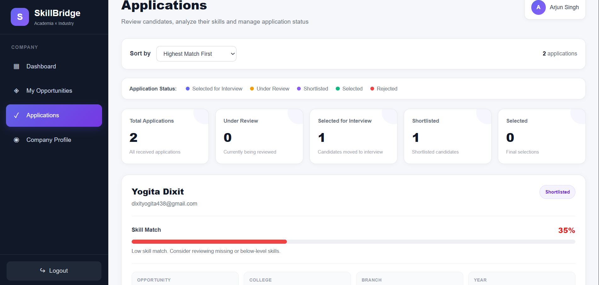
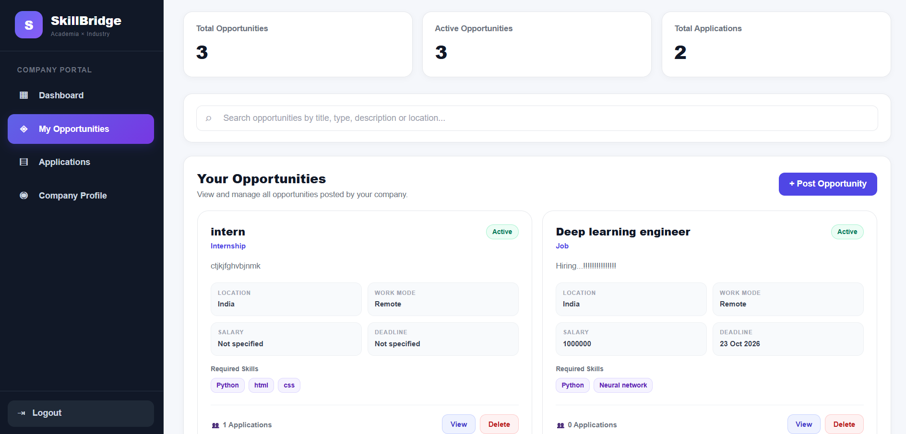

🚀 SkillBridge - Academia-Industry Collaboration Platform

## Smart India Hackathon 2026 | SIH26044

SkillBridge is a web-based platform designed to bridge the gap between **students and industry** by bringing skills, career opportunities, applications, and company recruitment into one unified platform.

The platform allows students to build and showcase their skills, discover relevant opportunities, and track their applications, while companies can publish opportunities and manage applications from a dedicated dashboard.

---

## 🎯 Problem

Students often struggle to find opportunities that match their actual skills, while companies face difficulties in reaching suitable student talent.

The gap between **academic skills and industry requirements** can lead to:

* Difficulty discovering relevant internships and opportunities
* Limited visibility of student skills
* Unorganized application processes
* Difficulty for companies in finding suitable candidates
* Lack of a direct student-industry connection

---

## 💡 Our Solution

**SkillBridge creates a direct digital bridge between students and companies.**

### Student Side

```text
Create Account
      ↓
Build Profile
      ↓
Add Skills
      ↓
Explore Opportunities
      ↓
Apply
      ↓
Track Applications
```

### Company Side

```text
Company Account
      ↓
Create Opportunity
      ↓
Publish
      ↓
Receive Applications
      ↓
View Candidates
      ↓
Manage Applications
```

---

## ✨ Key Features

### 👨‍🎓 Student Module

* Secure registration and login
* Email OTP verification
* Student profile management
* Skill management
* Opportunity discovery
* Opportunity details
* Online application workflow
* Application tracking
* Career and learning focused interface

### 🏢 Company Module

* Company registration and authentication
* Company profile
* Dedicated company dashboard
* Create and publish opportunities
* Manage posted opportunities
* View student applications
* Candidate/application management

### 🔐 Security

* JWT-based authentication
* Password hashing with bcrypt
* Protected API routes
* Role-based authorization
* OTP verification
* Environment variables for sensitive credentials

---

## 🖥️ Platform Screenshots

### 🔐 Login



---

### 👨‍🎓 Student Dashboard



---

### 🧠 Skills



---

### 💼 Opportunities


---

### 📝 Student Applications



---

### 🏢 Company Dashboard



---

### 👥 Company Applications



---
### Company Opportunity



---

## 🧠 Technology Stack

| Layer          | Technologies                          |
| -------------- | ------------------------------------- |
| Frontend       | HTML5, CSS3, JavaScript, Tailwind CSS |
| Backend        | Node.js, Express.js                   |
| Database       | MongoDB, Mongoose                     |
| Authentication | JWT, bcrypt                           |
| Email / OTP    | Nodemailer                            |
| API            | REST APIs                             |
| Development    | VS Code, Git, GitHub                  |

---

## 🏗️ System Architecture

```text
┌──────────────────────┐
│       STUDENT        │
└──────────┬───────────┘
           │
           ▼
┌──────────────────────┐
│     FRONTEND         │
│ HTML / CSS / JS      │
│ Tailwind CSS         │
└──────────┬───────────┘
           │
           │ REST API
           ▼
┌──────────────────────┐
│    NODE + EXPRESS    │
│      BACKEND         │
└──────────┬───────────┘
           │
           ▼
┌──────────────────────┐
│       MONGODB        │
│      DATABASE        │
└──────────▲───────────┘
           │
           │
┌──────────┴───────────┐
│       COMPANY        │
└──────────────────────┘
```

---

## 📂 Project Structure

```text
SkillBridge/
│
├── config/
│   └── db.js
│
├── middleware/
│   └── auth.js
│
├── models/
│   ├── Application.js
│   ├── OTP.js
│   ├── Opportunity.js
│   ├── Skill.js
│   └── User.js
│
├── routes/
│   ├── applicationRoutes.js
│   ├── authRoutes.js
│   ├── opportunityRoutes.js
│   ├── profileRoutes.js
│   └── skillRoutes.js
│
├── public/
│   ├── dashboard.html
│   ├── my-skills.html
│   ├── opportunities.html
│   ├── applications.html
│   ├── company-dashboard.html
│   ├── company-applications.html
│   └── ...
│
├── screenshots/
│   ├── login.png
│   ├── student-dashboard.png
│   ├── skills.png
│   ├── opportunities.png
│   ├── applications.png
│   ├── company-dashboard.png
│   └── company-applications.png
│
├── server.js
├── package.json
├── package-lock.json
├── .gitignore
└── README.md
```

---

## ⚙️ Local Setup

### 1. Clone the repository

```bash
git clone https://github.com/arjunsingh7711/SkillBridge-SIH26044.git
```

### 2. Open the project

```bash
cd SkillBridge-SIH26044
```

### 3. Install dependencies

```bash
npm install
```

### 4. Configure environment variables

Create a `.env` file in the project root.

```env
PORT=5000
MONGO_URI=your_mongodb_connection_string
JWT_SECRET=your_jwt_secret

EMAIL_USER=your_email
EMAIL_PASS=your_email_password
```

> ⚠️ Never upload the `.env` file to GitHub.

### 5. Start the server

```bash
npm run dev
```

The application will be available at:

```text
http://localhost:5000
```

---

## 🔐 Security Considerations

Sensitive credentials are not included in the repository.

The application uses:

* JWT authentication
* bcrypt password hashing
* Protected API endpoints
* Role-based access control
* OTP-based verification
* Environment variables for secrets

---

## 🌟 USP & Innovation

SkillBridge focuses on connecting **student skills directly with industry opportunities** rather than functioning only as a conventional job listing platform.

The platform brings together:

**Skills + Opportunities + Applications + Companies**

into a single workflow.

---

## 📈 Future Scope

The platform can be extended with:

### 🤖 AI-Based Opportunity Matching

Recommend opportunities based on student skills, interests, education, and experience.

### 📊 Skill Gap Analysis

Identify the skills missing between a student's current profile and their target career.

### 🎓 Personalized Learning Roadmaps

Recommend learning resources based on identified skill gaps.

### 📄 AI Resume Analysis

Analyze resumes and provide suggestions for improving industry readiness.

### 🏢 Institution-Industry Collaboration

Enable colleges and companies to collaborate on internships, projects, workshops, and recruitment drives.

### 📱 Mobile Application

Extend the platform to Android and iOS.

---

## 🎯 Target Users

| User            | Primary Purpose                            |
| --------------- | ------------------------------------------ |
| 👨‍🎓 Students  | Skills, opportunities & career development |
| 🏢 Companies    | Talent discovery & recruitment             |
| 🎓 Institutions | Academia-industry collaboration            |
| 👔 Recruiters   | Candidate/application management           |

---

## 🏆 Smart India Hackathon

**Problem Statement:** SIH26044

**Project:** SkillBridge

**Domain:** Academia-Industry Collaboration

SkillBridge aims to provide a practical digital solution for improving the connection between **student capabilities and industry requirements**.

---

## 📌 Project Status

**Status:** 🚧 Active Development

The current implementation includes authentication, student profiles, skill management, opportunities, applications, and company-side opportunity/application management.

---

## 👨‍💻 Repository

**GitHub:**
https://github.com/arjunsingh7711/SkillBridge-SIH26044

---

## 📜 License

This project is developed for educational and hackathon purposes.
